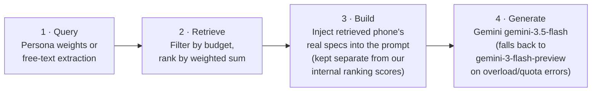

# GalaxyMatch AI

GalaxyMatch AI recommends a Samsung Galaxy phone from a 20-phone catalogue (`data/phones.csv`), scoring each candidate on 5 weighted dimensions — camera, performance, battery, display, value — via a transparent weighted sum. There's no black box: every recommendation ships with a per-dimension score breakdown.

**Live site:** [galaxymatch-five.vercel.app](https://galaxymatch-five.vercel.app)

---

## Table of contents

- [Overview](#overview)
- [Interfaces](#interfaces)
- [Architecture](#architecture)
- [Tech stack](#tech-stack)
- [Guardrails](#guardrails)
- [Approaches we considered and rejected](#approaches-we-considered-and-rejected)
- [Challenges and fixes](#challenges-and-fixes)
- [Testing](#testing)

---

## Overview

The core idea: filter Samsung Galaxy phones by budget, rank the remaining candidates with a weighted sum across 5 dimensions, then use Gemini to explain the top result in natural language — grounded in that phone's real specs, not invented ones.

## Interfaces

There are two front ends built on the same underlying engine:

| Interface | Description |
|---|---|
| **Jupyter notebook** (graded deliverable) | ipywidgets UI with a persona picker, a free-text input box, live weight sliders, and a direct call to Gemini. |
| **Live website** | Static HTML/CSS/JS hosted on Vercel. The results page and the free-text box both call Gemini live, routed through Vercel serverless functions (`api/explain.js`, `api/parse.js`) so the API key never reaches the browser. |

## Architecture

This is a retrieval-augmented generation (RAG) pipeline, implemented twice — once in Python for the notebook, once in JavaScript for the website — and kept in sync by hand. Both implementations follow the same 4 steps:

**Step-by-step:**

1. **Query** — Convert the user's input (a chosen persona, or free text) into dimension weights.
2. **Retrieve** — Filter the catalogue by budget, then rank remaining phones by the weighted sum.
3. **Build** — Format the top-ranked phone's real specs into the Gemini prompt, kept labelled separately from the app's own internal ranking scores.
4. **Generate** — Call Gemini (`gemini-3.5-flash`, with automatic fallback to `gemini-3-flash-preview` on overload or quota errors) to produce the explanation.

## Tech stack

- **Notebook:** Python 3.11, pandas, Jupyter/ipywidgets, `google-genai` SDK
- **Website:** Vanilla HTML/CSS/JS — no framework, no build step — plus GSAP and Lenis
- **API layer:** Vercel serverless functions (Node)
- **Testing:** pytest, 17 tests
- **Hosting:** Vercel (site), GitHub (code)

## Guardrails

- Free-text input is screened for abuse/threats before it reaches Gemini.
- PII (email addresses, phone numbers) is redacted from user input.
- Requests about a non-Samsung phone (e.g. "I want an iPhone") are refused with "we only cover Samsung Galaxy phones," rather than guessing an answer.
- Gemini's response is checked before being shown to the user — it must cite real specs, and it must never leak the app's internal ranking scores to the customer.

## Approaches we considered and rejected

| Approach | Why not |
|---|---|
| **Fine-tuning** | 20 rows is nowhere near enough training data, and the actual gap was missing knowledge, not wrong behavior — the wrong tool for the job. |
| **Vector database** | Nothing in the dataset is long-form enough to embed — a spreadsheet filtered by a rule already functions as a knowledge base. |
| **Autonomous agent** | The decision logic is fixed (filter by budget, then rank); there's no judgment call left for an agent to make. |

## Challenges and fixes

**Problem:** The prompt handed Gemini a phone's name and five bare scores while instructing it to "mention the phone's features" and "never invent specifications" — an instruction pair it couldn't satisfy at once.
**Fix:** Retrieve and inject the phone's real specs into the prompt before generation.

**Problem:** The Gemini free tier allows 20 requests per day, per model — not per minute. A live outage initially looked like a bug.
**Fix:** Diagnosed the outage from actual server logs (real 429 quota errors, not a code bug), then addressed the underlying waste — the site now caches repeat answers and stops retrying for a few minutes once it detects the day's quota is used up.

**Problem:** A user typing a competitor phone name still got a random Samsung recommendation, because nothing checked what was actually being asked.
**Fix:** Added an explicit refusal check, verified by an automated test.

## Testing

17 pytest tests cover the recommendation logic and guardrails, including the competitor-phone refusal case.
